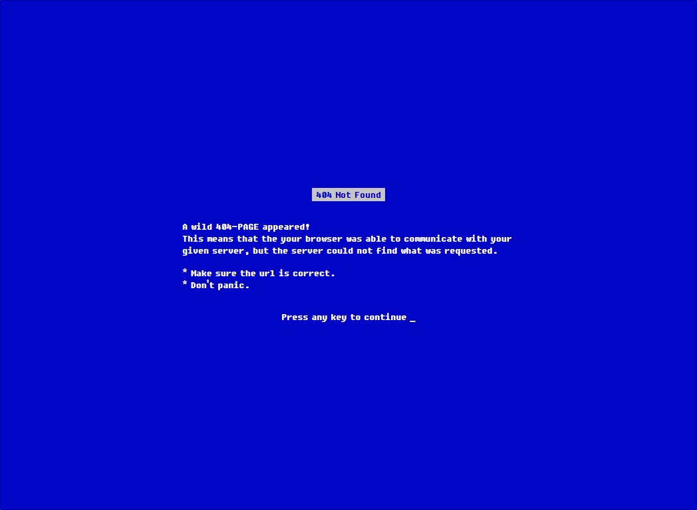
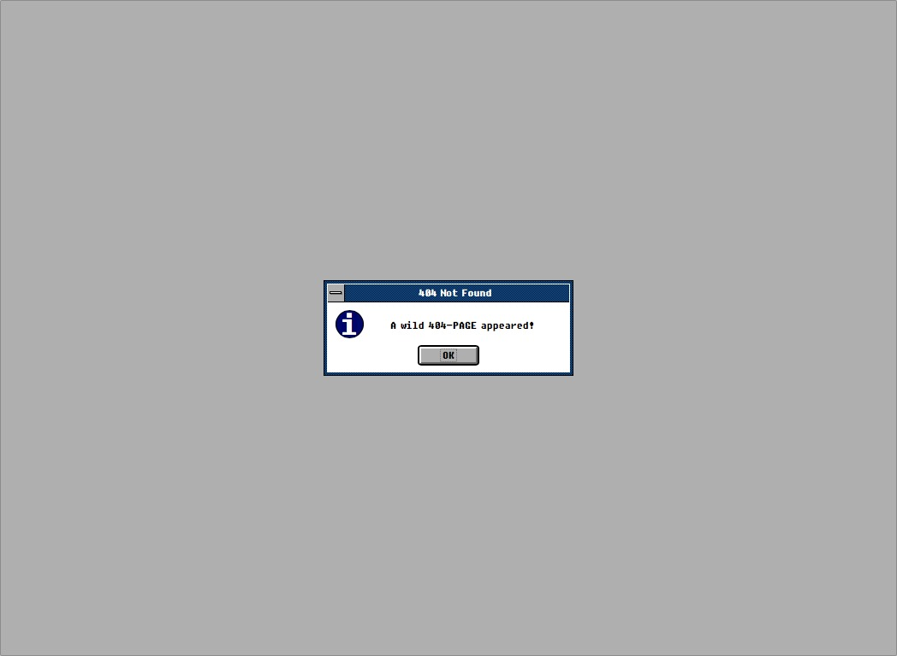
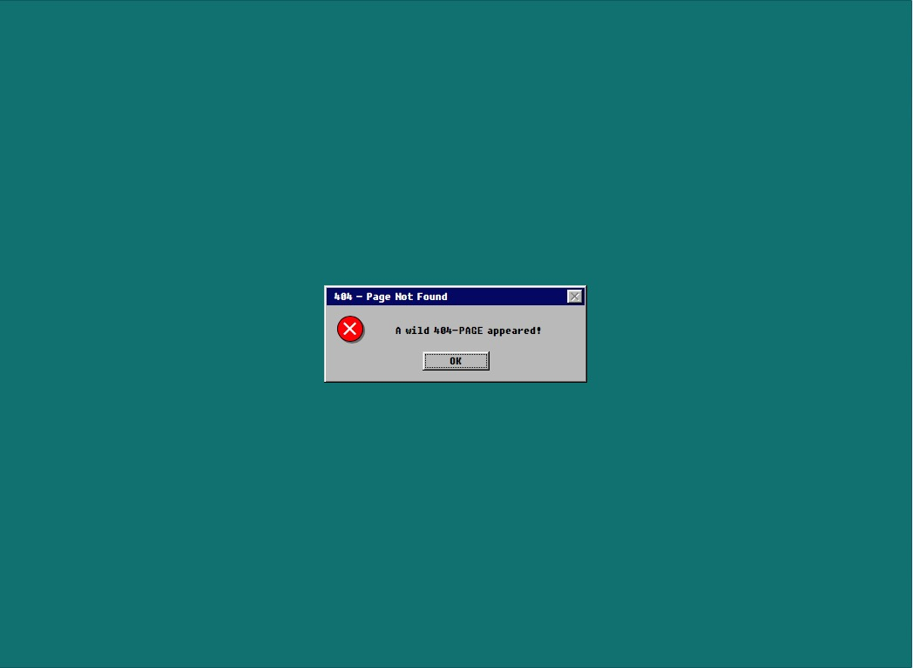
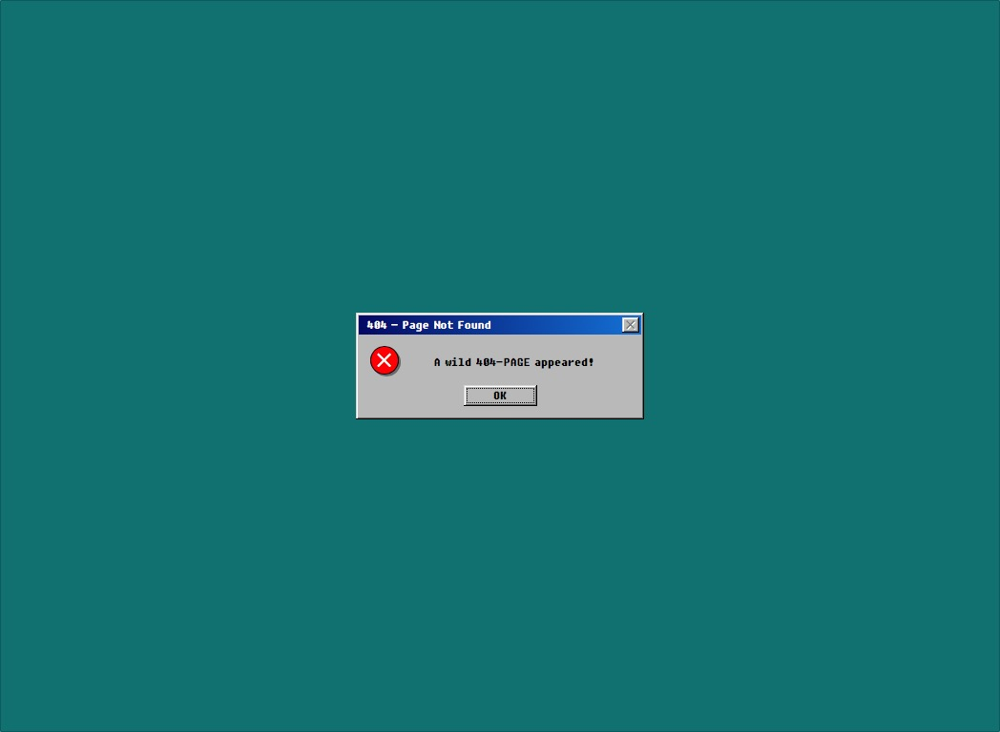

# retro-404
retro 404 not found page with dos/windows3.0/windows95/windows98 UI:  

# license
 This work is licensed under a <a rel="license" href="http://creativecommons.org/licenses/by-sa/4.0/">Creative Commons Attribution-ShareAlike 4.0 International License</a>.
